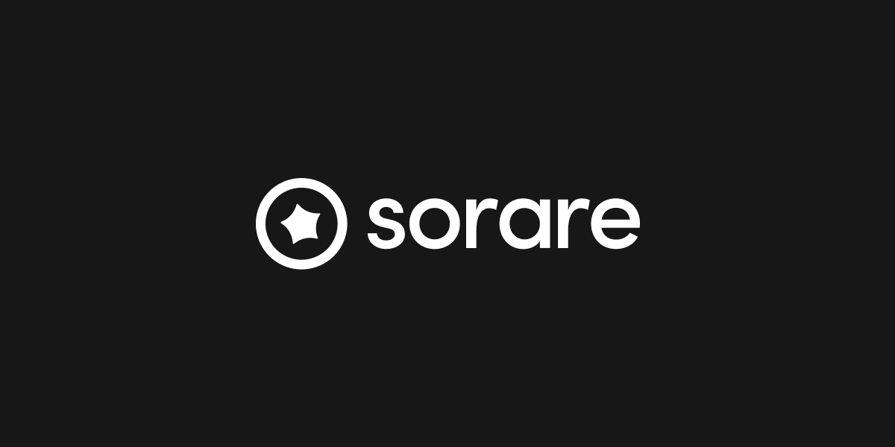

<!-- logo -->
<p align="center">
  
</p>

<!-- tag line -->
<h4 align='center'>JavaScript Crypto helpers for Sorare</h4>

<!-- primary badges -->
<p align="center">
  <a href="https://www.typescriptlang.org/">
    
  </a>
  <a href="https://www.npmjs.com/package/@sorare/crypto">
    
  </a>
  <a href="https://github.com/sorare/crypto/actions/workflows/node.js.yml">
    
  </a>
  <a href="https://starkware.co/">
    
  </a>
</p>

`@sorare/crypto` is a JavaScript library (TypeScript types included) providing various crypto functions to be used to sign your Sorare LimitOrder objects in order to make a bid, create or accept an offer. It can be used in both NodeJS and Browser environments.

# Functions

## `signLimitOrder`

The `signLimitOrder(privateKey, limitOrder)` function is used to sign a `LimitOrder` object with a Sorare private key.

```ts
import { signLimitOrder } from '@sorare/crypto';

const privateKey = /* Your Sorare private key */;
const limitOrder = /* The LimitOrder object you get from GraphQL */;

const signature = signLimitOrder(privateKey, limitOrder);
```

# C++ bindings

Starting from v1.3.2, C++ bindings can be used for faster `verifyTransfer` and `verifyLimitOrder` operations. It uses Starkware's [crypto-cpp](https://github.com/starkware-libs/crypto-cpp) library and can be enabled by adding `USE_STARKWARE_CRYPTO_CPP=true` to your env. Please note that this variable also needs to be set when `yarn install` runs in order to build the C++ bindings using [node-gyp](https://github.com/nodejs/node-gyp).

# License

`@sorare/crypto` is [MIT licensed](LICENSE).
